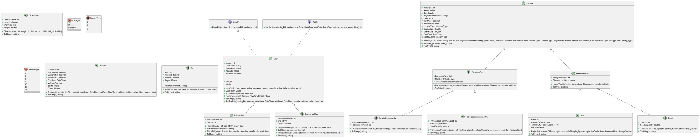

# H2 AutoAuction

## Indholdsfortegnelse
* [Beskrivelse](#beskrivelse)
* [Entity Relationship Diagram](#entity-relationship-diagram-erd)
* [Unified Modeling Language](#unified-modeling-language-uml)
* [Brugere](#brugere)
  * [Ervervsbruger](#ervervsbruger)
  * [Privatbruger](#privatbruger)
* [Auktioner](#auktioner)
  * [Oprettelse af auktioner](#oprettelse-af-auktioner)
  * [Afslutning af auktioner](#afslutning-af-auktioner)
* [Biler](#biler)
* [Bud](#bud)

## Beskrivelse
I dette projekt har vi lavet et simpelt auktions hus til at handle med biler.
Programmet er skrevet i [C#](https://en.wikipedia.org/wiki/C_Sharp_(programming_language)) med [.NET 6.0](https://en.wikipedia.org/wiki/.NET) og bruger [Microsoft SQL Server](https://en.wikipedia.org/wiki/Microsoft_SQL_Server) som database.
Der er håndtering af brugere, biler, auktioner og bud.

## Entity Relationship Diagram (ERD)

## Unified Modeling Language (UML)

## Brugere
Der er to forskellige brugere i programmet, en ervervsbruger og en privatbruger.

### Ervervsbruger
En ervervsbruger kan oprette auktioner og byde på auktioner.
Når en ervervsbruger vinder en auktion, har de mulighed for at gå i minus på deres balance til en hvis grad, som er bestemt af mængden af kredit de har f.eks. Hvis en ervervsbruger har 1000 kr. i kredit, kan de gå 1000 kr. i minus.

### Privatbruger
En privatbruger kan oprette auktioner og byde på auktioner.
Når en privatbruger vinder en auktion, skal de betale med det samme, og kan ikke gå i minus på deres balance.

## Auktioner

### Oprettelse af auktioner
Når en bruger opretter en auktion, skal de angive en startpris, en slutdato og en bil.
Når en auktion er oprettet, kan den ikke ændres.

### Afslutning af auktioner
Når en auktion er afsluttet, kan der ikke bydes på den mere.

Systemet køre decentaliseret i den sans at det er på kundernes computere der udarbejdes hvilke auktioner der er afsluttet, så når en auktion er afsluttet går der op til 1 minut før den er afsluttet for alle brugere.

Fra et sikkerheds synspunkt er denne løsning forfærdenlig, helst vil man have en cental server der håndtere det, og så kontakter klienterne serveren istedet for at kontakte databasen direkte.

Vi har `Client -> Database`, hvor vi gerne ville have `Client -> Server -> Database`. Klienten skal helst aldrig snakke direkte med databasen.

Højeste bud er normalt set vinderen af auktionen, så længe de har penge nok på deres konto til at betale for bilen, ellers går bilen til det næsthøjeste bud, og så videre.

## Biler
Der er fire forskellige biltyper, en private personbiler, ervervs personbiler, busser og lastbiler.
Alle biler har et navn, et registreringsnummer, en årgang, og et kilometertal, en helt masse andet.
Se [UML](#unified-modeling-language-uml) diagrammet for mere information om bilerne og deres egenskaber.

## Bud
Et bud er en pris en bruger er villig til at betale for en bil, og er en del af en auktion.
Det er en `en til mange` relation i den sans at en auktion kan have mange bud.
Brugere kan godt byde flere gange på samme auktion, så længe at de ikke er den seneste byder.
